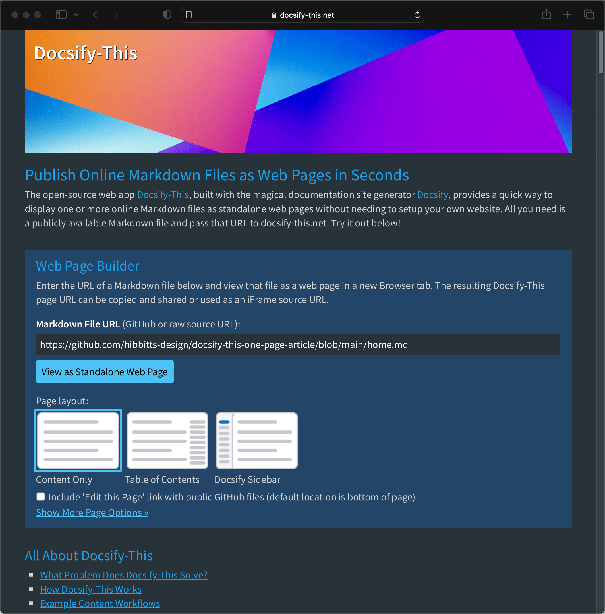
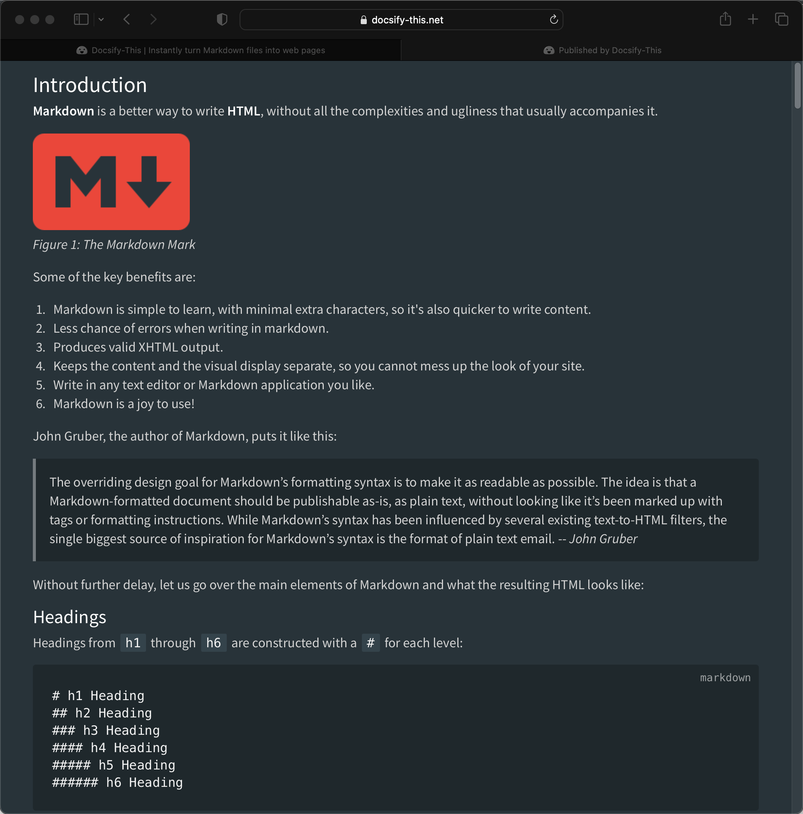

  <meta property="og:title" content="Docsify-This" />
  <meta property="og:description" content="Display Markdown files as standalone web pages in seconds using Docsify, with no website required." />
  <meta property="og:type" content="website" />
  <meta property="og:url" content="https://docsify-this.net" />
  <meta property="og:image" content="https://raw.githubusercontent.com/hibbitts-design/docsify-this/main/docs/images/screenshot.png" />

[Docsify-This.net](https://docsify-this.net) version 1.5 is now available. Highlights include:   

✅ Support for dark mode via optional URL parameter (`dark-mode`), activation based on system OS-level setting  
✅ Support for Wikilinks, as used by #Obsidian  
✅ Addition of line height option in the Web Page Builder as an optional URL parameter (`line-height`)  
✅ Addition of page Browser tab title in the Web Page Builder as an optional URL parameter (`title`)  
✅ Addition of Open Sans font choice (default  Sakai LMS font)  

  
Figure 1 - Docsify-This Web app in dark mode.

===

  
Figure 2 - Docsify-This one page article in dark mode.

Let's review the steps to go from a GitHub Markdown file to a web page with Docsify-This:

1. Create or view a Markdown file on GitHub and copy the URL
2. Go to [http://Docsify-This.net](http://Docsify-This.net), paste the URL into the Web Page Builder (shown below), and tap the "View as Standalone Web Page" button
3. That's it, there is no step 3 and no need to setup your own website or run any build process!

The Docsify-This open source project might just now be the easiest way to turn a GitHub Markdown file into a simple web page (and begin to benefit from the possibilities of a Markdown publishing workflow)!

Want to get more frequent updates about my current projects and work? You can find me on Mastodon at [https://mastodon.social/@hibbittsdesign](https://mastodon.social/@hibbittsdesign).
