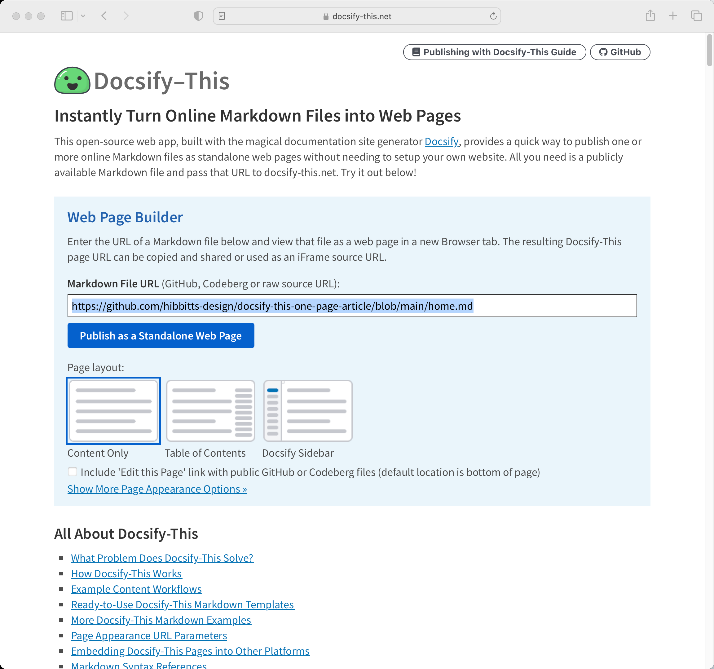

  <meta property="og:title" content="Docsify-This" />
  <meta property="og:description" content="Display Markdown files as standalone web pages in seconds using Docsify, with no website required." />
  <meta property="og:type" content="website" />
  <meta property="og:url" content="https://docsify-this.net" />
  <meta property="og:image" content="https://raw.githubusercontent.com/hibbitts-design/docsify-this/main/docs/images/screenshot.png" />

[Docsify-This.net](https://docsify-this.net) version 1.5.3 is now available. The main highlight of this release is improvements to the Web app UI, featuring an updated page banner (now with the Docsify logo).

  
Figure 1 - Docsify-This Web app

Want to get more frequent updates about my current projects and work? You can find me on Mastodon at [https://mastodon.social/@hibbittsdesign](https://mastodon.social/@hibbittsdesign).

===