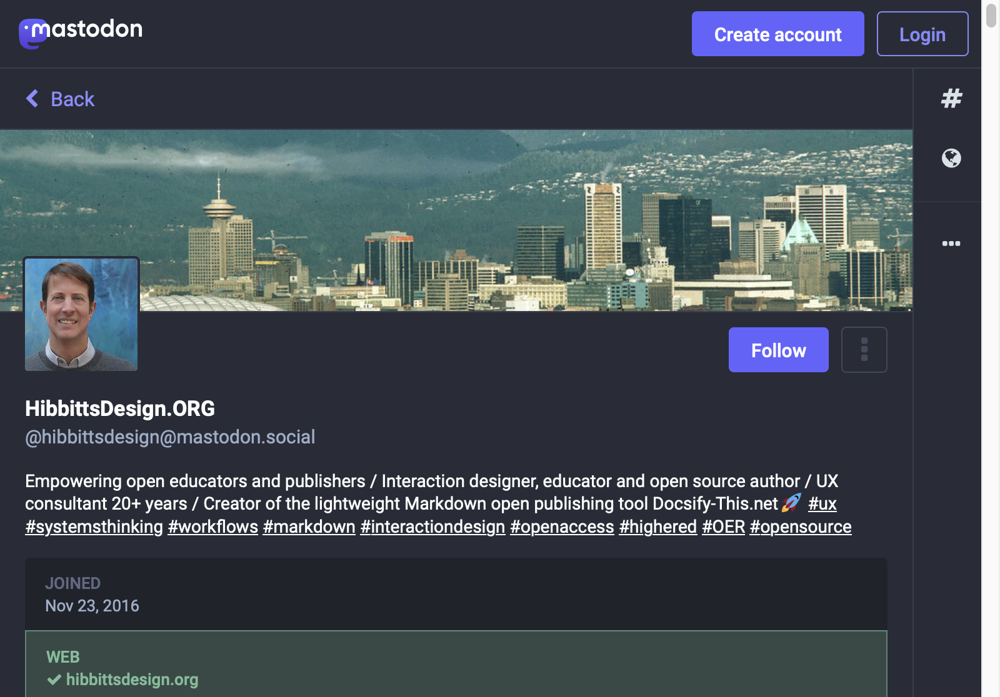

  
Figure 1 - HibbittsDesign.ORG Mastodon Page

I've been pretty pleased with how Mastodon is shaping up as a means to post to the [Fediverse](https://en.wikipedia.org/wiki/Fediverse), so I've decided to only post there for now - you can find me on Mastodon at [https://mastodon.social/@hibbittsdesign](https://mastodon.social/@hibbittsdesign) and as well at my new [HibbittsDesign.org](https://www.hibbittsdesign.org) site.

===